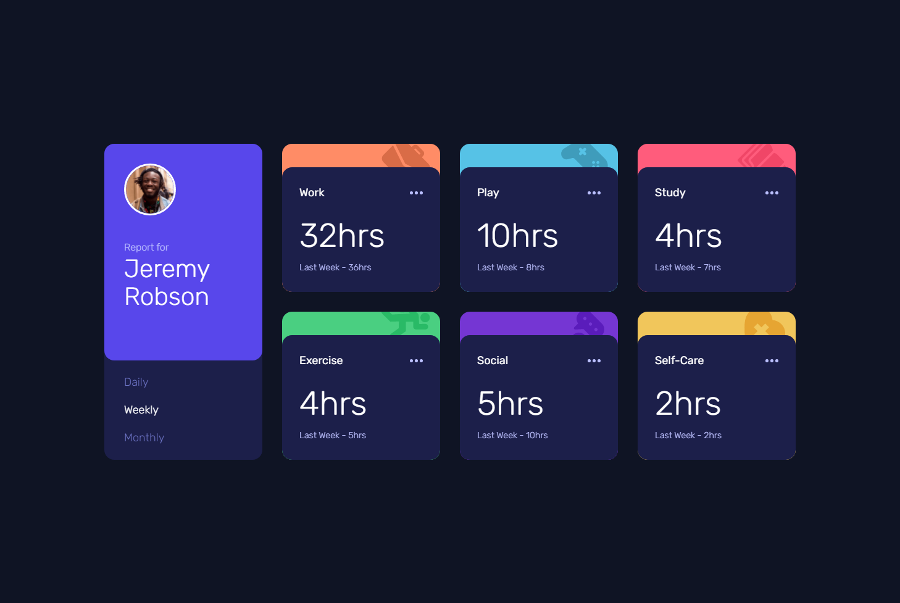

# Frontend Mentor - Time tracking dashboard solution

This is a solution to the [Time tracking dashboard challenge on Frontend Mentor](https://www.frontendmentor.io/challenges/time-tracking-dashboard-UIQ7167Jw). Frontend Mentor challenges help you improve your coding skills by building realistic projects. 

## Table of contents

- [Overview](#overview)
  - [The challenge](#the-challenge)
  - [Screenshot](#screenshot)
  - [Links](#links)
- [My process](#my-process)
  - [Built with](#built-with)
  - [What I learned](#what-i-learned)
  - [Continued development](#continued-development)
- [Author](#author)

## Overview

### The challenge

Users should be able to:

- View the optimal layout for the site depending on their device's screen size
- See hover states for all interactive elements on the page
- Switch between viewing Daily, Weekly, and Monthly stats

### Screenshot



### Links

- HTML Solution URL: [HTML](https://github.com/JustANipple/time-tracking-dashboard/blob/master/index.html)
- CSS Solution URL: [CSS](https://github.com/JustANipple/time-tracking-dashboard/blob/master/styles/css/main.css)
- JavaScript Solution URL: [JS](https://github.com/JustANipple/time-tracking-dashboard/blob/master/scripts/script.js)
- Live Site URL: [LIVE](https://justanipple.github.io/time-tracking-dashboard/)

## My process

### Built with

- Semantic HTML5 markup
- CSS custom properties
- Flexbox
- CSS Grid
- Mobile-first workflow
- Josh Comeau CSS reset
- SCSS precompiler
- JavaScript animations
- JSON data

### What I learned

Activity parts where almost the same components, so instead of making every single block with HTML, i tried making it in JavaScript and then assigning colors and images based on the activity name they had

This is the component part that i'm proud of:

```js
let icon = ("icon-" + data[i].title.toLowerCase() + ".svg").replace(" ", "-");
        const type = data[i].title.replace(" ", "-");
        const time = data[i].timeframes.weekly.current;
        const lastTime = data[i].timeframes.weekly.previous;

        const block = 
        `
        
        <div class="dashboard_activity">
          <div class="activity_header">
            <p class="header_type">${type}</p>
            
          </div>
          <div class="activity_time">
            <p class="time_current">${time}hrs</p>
            <p class="time_last">Last Week - ${lastTime}hrs</p>
          </div>
        </div>
        `;
```

### Continued development

Asynchronous methods make things harder than a simple code that goes from top to bottom. I've been stuck in the async function so i just made a chain of functions in it to make the code work. I'll work more on Premises

## Author

- Frontend Mentor - [@JustANipple](https://www.frontendmentor.io/profile/JustANipple)
